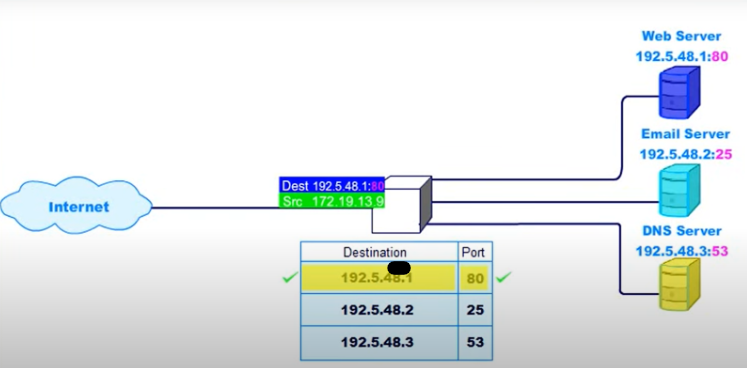
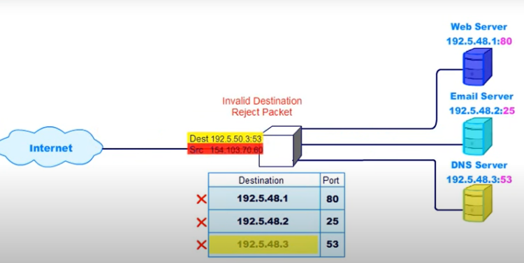
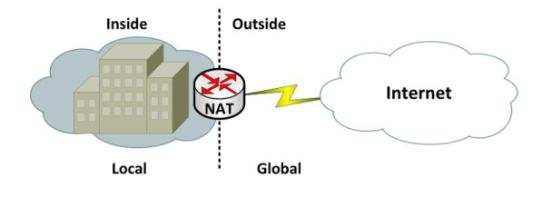
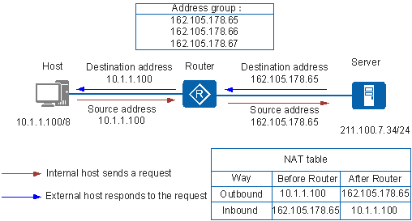
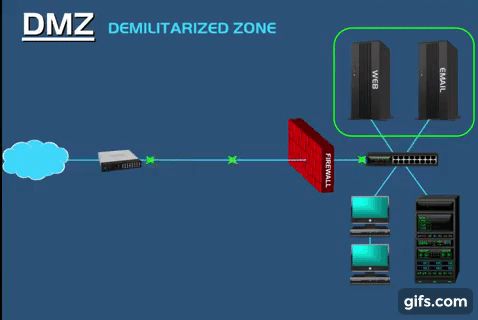
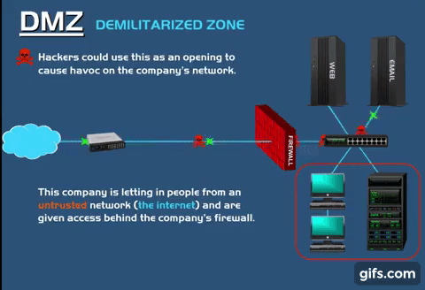
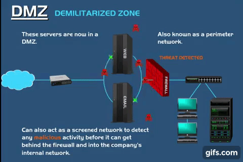
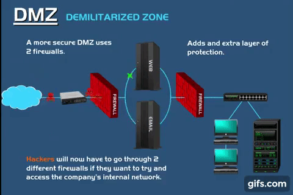

<h1 style="text-align: center">Domain Control with Packet Filtering, NAT, WAF, DMZ</h1>

<h2>MỤC LỤC</h2>

- [1. Domain Control](#1-domain-control)
  - [1.1. Định nghĩa](#11-định-nghĩa)
    - [a) Domain](#a-domain)
    - [b) Domain Controller](#b-domain-controller)
  - [1.2. Vai trò](#12-vai-trò)
- [2. Domain Control with Packet Filtering](#2-domain-control-with-packet-filtering)
  - [2.1. Khái niệm Packet Filtering](#21-khái-niệm-packet-filtering)
  - [2.2. Cách sử dụng](#22-cách-sử-dụng)
  - [2.3. Demo](#23-demo)
- [3. Domain Control with NAT](#3-domain-control-with-nat)
  - [3.1. Khái niệm NAT](#31-khái-niệm-nat)
  - [3.2. Cơ chế](#32-cơ-chế)
  - [3.3. Demo](#33-demo)
- [4. Domain Control with WAF](#4-domain-control-with-waf)
- [5. Domain Control with DMZ](#5-domain-control-with-dmz)
  - [5.1. Khái niệm](#51-khái-niệm)
  - [5.2. Co che](#52-co-che)
  - [5.3. Cách sử dụng](#53-cách-sử-dụng)
- [6. Tổng kết](#6-tổng-kết)

## 1. Domain Control

### 1.1. Định nghĩa

#### a) Domain

Domain là một mô tả tập hợp tất cả người dùng, máy chủ, hệ thống dữ liệu, mạng internet hay các tài nguyên bất kỳ được quản lý theo nguyên tắc chung. Một domain có thể có nhiều domain controller.

#### b) Domain Controller

Domain controller là một hệ thống máy chủ được thiết lập với mục đích quản lý hay kiểm tra một tên miền bất kỳ nào đó.

Domain controller hoạt động tương tự như một người gác cổng được ủy quyền user cũng như xác thực có trách nhiệm quản lý an ninh mạng và những vấn đề khác có liên quan đến dữ liệu.

Cách sử dụng: Toàn bộ Request của User sẽ được chuyển đến Domain Controller để được xác thực và ủy quyền. Trước khi truy cập theo Request tương ứng thì người dùng cần xác nhận danh tính của bản thân

### 1.2. Vai trò

Một Domain Controller sẽ chịu trách nhiệm lưu trữ các đối tượng cho Domain mà nó được cài đặt. Tuy nhiên, một domain sẽ được chỉ định với chức năng như một máy chủ của danh mục chung.

Từ đó, tiến hành lưu trữ mọi đối tượng, thông tin, dữ liệu với định dạng, đặc điểm khác nhau đến từ tất cả những Domain trong Forest. Chính nhờ việc này, quá trình lưu trữ sẽ trở nên đơn giản, hiệu quả hơn rất nhiều.

Với một đối tượng không nằm trong Domain, một nhóm thuộc tính sẽ được tiến hành lưu trữ trong bản sao một phần của Domain đó. Vì vậy, một danh mục chung sẽ tiến hành lưu trữ một bản sao miền hoàn chỉnh. Cùng với đó là việc lưu trữ bản sao Read-only. Việc này diễn ra với dữ liệu của mọi nhóm domain khác bên trong forest.

## 2. Domain Control with Packet Filtering

### 2.1. Khái niệm Packet Filtering

Packet Filtering là một kỹ thuật tường lửa sử dụng để truy cập mạng kiểm soát bằng cách giám sát các gói tin đi và đến và cho phép họ vượt qua hoặc dừng lại dựa trên nguồn và đích Internet Protocol (IP) địa chỉ, giao thức và port.

Trong giao tiếp mạng, một nút truyền một gói tin đó được lọc và phù hợp với các quy tắc và chính sách được xác định trước. Khi xuất hiện, một gói hoặc là chấp nhận hoặc từ chối.

Packet Filtering Firewalls được chia thành hai loại:

- Stateless Firewalls kiểm tra các gói độc lập với nhau và thiếu ngữ cảnh
- Stateful Firewalls ghi nhớ thông tin về các gói đã truyền trước đó.

Lợi ích:

- Không sử dụng nhiều tài nguyên. Điều này có nghĩa là Firewall không có tác động lớn đến hiệu suất hệ thống và tương đối đơn giản.
- Ngoài ra còn nhanh chóng do packet filtering không kiểm tra nội dung bên trong của gói tin mà chỉ kiểm tra 1 số trường bên ngoài như source, destination, port, …

Hạn chế:

- Khả năng bảo vệ của Packet Filtering Firewall rất cơ bản và còn nhiều hạn chế.
- Dễ dàng bị vô hiệu trong trường hợp một yêu cầu độc hại được cho phép từ một địa chỉ nguồn đáng tin cậy.

### 2.2. Cách sử dụng

Khi có 1 gói tin đi đến, nó sẽ đi qua packet filter trước để kiểm tra. Ở đây nó sẽ check những thông tin như là source, destination, port để check xem có phù hợp hay không. Nếu kiểm tra phù hợp thì sẽ cho phép gói tin đi tiếp đến đích còn không thì sẽ loại gói tin khỏi đường truyền

- Ví dụ trường hợp thành công: Ở đây đã xác thực được điểm đến, cho phép gói tin đi tiếp đến đích.



- Ví dụ trường hợp thất bại: Ở đây không xác thực được điểm đến, gói tin bị loại khỏi đường truyền.



### 2.3. Demo

Ý tưởng xây dựng dựa trên minh họa sau đây: [Demo Idea](https://www.youtube.com/watch?v=x0SyDYp0Brg)

Dựa trên ý tưởng này, mình xây dựng một chương trình python đơn giản để kiểm tra gói tin theo các firewall rules của Packet Filtering.

Input gồm 6 gói tin được gửi đến


Các rules thiết lập cho firewall như sau


Bây giờ mình sẽ giải thích luồng xử lý cơ bản của chương trình

Setup

```python
import csv

rulesFile = "firewall_rules.csv"  # firewall filtering rules
inputFile = "packet_input.txt"  # input contains packets
outputFile = "accept_packet_output.txt"  # output pass packets
```

Lọc ra các dữ liệu cần thiết để tiến hành lọc gói tin

```python
def writeToDictionary(packet):
    # write necessary details in ip datagram into data structure
    pktDetails = {}
    pktDetails["protocol"] = packet[69:71]  # TCP = 06  UDP = 11
    pktDetails["source address"] = packet[78:89]
    pktDetails["destination address"] = packet[90:101]
    pktDetails["source port"] = packet[102:107]
    pktDetails["destination port"] = packet[108:113]
    if pktDetails["protocol"] == "06":
        pktDetails["flag"] = packet[141:143]  # ACK set = 10 SYN = 02
    return pktDetails

```

Tiếp theo xây dựng các hàm tiện ích để thể hiện việc từ chối hay tiếp nhận gói tin

```python
def rejectPacket(index):
  print(f"Packet {index} rejected by the firewall")

def passPacket(file, datagram, index):
    with open(file, "a+") as output:
        output.seek(0)
        output.write(f"Package {index}: {datagram}")
    print(f"Packet {index} accepted by the firewall")
```

Viết điều kiện kiểm tra để lọc gói tin. Ở đây vì để cho đơn giản, mình sẽ lọc nếu protocol của gói tin gửi đến là **TCP** hoặc **UDP**. Các field chung cần kiểm tra là source address, destination address, source port, destination port. Khi đã match hết các field trên thì kiểm tra xem Action là **Deny** hay **Allow** để tiến hành loại bỏ hay chấp thuận gói tin đó. Ngoài ra, đối với TCP thì còn kiểm tra flag của gói tin để kiểm tra xem có phải là gói ACK hay không.

```python
def conditionFilter(datagram, rule):
    return (
        (
            datagram["source address"] == rule["Source address"]
            or rule["Source address"] == "Any"
        )
        and (
            datagram["destination address"] == rule["Destination address"]
            or rule["Destination address"] == "Any"
        )
        and (
            datagram["source port"] == rule["Source port"]
            or rule["Source port"] == "Any"
        )
        and (
            datagram["destination port"] == rule["Destination port"]
            or rule["Destination port"] == "Any"
        )
        and (
            datagram["protocol"] == "11"  # UDP
            or (
                datagram["protocol"] == "06"  # TCP need to check flag
                and (datagram["flag"] == rule["ACK"] or rule["ACK"] == "Any")
            )
        )
    )
```

Tiến hành lọc gói tin

```python
def firewall(packet, index):
    # get datagram from packet
    datagram = writeToDictionary(packet)
    with open(rulesFile, mode="r") as file:

        csvFile = csv.DictReader(file)  # read firewall filtering rules
        flag = False
        for row in csvFile:
            if flag == True:
                break
            if (
                datagram["protocol"] == "11" or datagram["protocol"] == "06"
            ):  # Filtering for UDP and TCP
                if conditionFilter(datagram, row):
                    flag = True
                    if row["Action"] == "Deny":
                        rejectPacket(index)
                        continue
                    elif row["Action"] == "Allow":
                        passPacket(outputFile, packet, index)
                        continue
        if flag == False:
            passPacket(outputFile, packet, index)
```

Chạy chương trình để kiểm tra kết quả

```python
index = 0
with open(inputFile) as inputFile:
    for datagram in inputFile:
        index += 1
        firewall(datagram, index)
```

**Kết quả đạt được như sau**

Thông báo các gói tin được chấp thuận và bị từ chối. Ở đây gói tin 1,2,4,5 bị từ chối và chỉ có gói tin 3 và 6 được đi tiếp


File output chứa các gói tin được chấp thuận đi tiếp


## 3. Domain Control with NAT

### 3.1. Khái niệm NAT

Network Address Translation (NAT) là kỹ thuật cho phép chuyển đổi từ một địa chỉ IP private này thành một địa chỉ IP khác (public). Được dùng phổ biến trong mạng sử dụng địa chỉ cục bộ, cần truy cập đến mạng public (Internet). Vị trí thực hiện NAT là router biên kết nối giữa hai mạng

Có thể xem nó như một Router, chuyển tiếp các gói tin giữa những lớp mạng khác nhau trên một mạng lớn, còn có thể coi như một Firewall (tường lửa) cơ bản.

Trong giao tiếp mạng, một nút truyền một gói tin đó được lọc và phù hợp với các quy tắc và chính sách được xác định trước. Khi xuất hiện, một gói hoặc là chấp nhận hoặc từ chối.



NAT được chia thành ba loại chính:

- Static Nat chuyển đổi một địa chỉ IP này sang một địa chỉ khác một cách cố định, được cài đặt thủ công.
- Dynamic NAT ánh xạ một địa chỉ IP này sang một địa chỉ khác một cách tự động. Bất kỳ một địa chỉ IP nào nằm trong dải địa chỉ IP công cộng đã được định trước đều có thể được gán một thiết bị bên trong mạng.
- NAT Overload (còn gọi là Port Address Translation) là một dạng của Dynamic NAT, nó thực hiện ánh xạ nhiều địa chỉ IP thành một địa chỉ (many - to - one) và sử dụng các địa chỉ số cổng khác nhau để phân biệt cho từng chuyển đổi, phân biệt bởi port.


Lợi ích:

- Tiết kiệm địa chỉ IPv4 khi mà lượng người dùng truy cập internet ngày càng tăng cao, cứ tưởng tượng nếu mỗi người truy cập internet đều có riêng một địa chỉ IPv4 cố định thì con số địa chỉ IPv4 khổng lồ đến mức nào? Có còn đủ dùng hay không?
- Giúp che giấu IP bên trong mạng LAN.
- NAT giúp nhà quản trị mạng lọc được các gói tin đến và xét duyệt quyền truy cập của IP public đến 1 port bất kỳ.

Hạn chế:

- Khi dùng kỹ thuật NAT, CPU sẽ phải kiểm tra và tốn thời gian để thay đổi địa chỉ IP. Điều này làm tăng độ trễ trong quá trình switching, ảnh hưởng đến tốc độ mạng.
- Khó khăn khi cần kiểm tra nguồn gốc IP hoặc truy tìm dấu vết của gói tin.

### 3.2. Cơ chế

Có thể mô tả ngắn gọn cơ chế của NAT như sau:



- NAT duy trì một bảng thông tin về mỗi gói tin được gửi qua. Khi một máy tính trên mạng kết nối đến 1 website trên Internet, header của địa chỉ IP nguồn được thay thế bằng địa chỉ Public đã được cấu hình sẵn trên NAT server.

- Sau khi có gói tin trở về NAT dựa vào bảng record mà nó đã lưu về các gói tin, thay đổi địa chỉ IP đích thành địa chỉ của PC trong mạng và chuyển tiếp đi.

- Thông qua cơ chế đó quản trị mạng có khả năng lọc các gói tin được gửi đến hay gửi từ một địa chỉ IP và cho phép hay ngăn truy cập đến một port cụ thể

### 3.3. Demo

## 4. Domain Control with WAF

## 5. Domain Control with DMZ
### 5.1. Khái niệm DMZ (Demilitarized Zone)

- DMZ là một vùng mạng **nằm giữa** mạng LAN và mạng Internet. Đây thường là nơi chứa các Public Servers cung cấp dịch vụ cho những host ở trong mạng LAN cũng như những host từ Internet. Các gói tin phải đến DMZ trước khi vào được mạng LAN.

- Các dịch vụ thường được triển khai trong vùng DMZ là: Web Server, Mail Server, DNS Server, FTP Server…

### 5.2. Cơ chế
- <u>**Bài toán**</u>: Hệ thống mạng LAN có thể bao gồm những Server cung cấp những dịch vụ cơ bản (Directory service, Database, DNS, DHCP, File/Print Sharing, Web, Mail, FTP...). Trong đó, những Server như Web, FTP, Mail, DNS... thường sẽ phục vụ cho cả user bên trong và bên ngoài mạng LAN. Nếu hacker từ mạng bên ngoài tấn công và chiếm quyền kiểm soát những Pulbic Servers này thì rất có thể chúng sẽ dựa vào đó để thâm nhập sâu hơn vào những máy trạm ở bên trong. Bài toán đặt ra là làm sao bảo mật hệ thống mạng LAN an toàn nhưng vẫn tiếp tục cung cấp dịch vụ của Web, FTP, Mail, DNS... cho Internet?

- DMZ ra đời để giải quyết bài toán này theo cơ chế: DMZ sẽ thuộc những đường mạng hoặc subnet mạng khác với mạng LAN. Như vậy các host từ Internet sẽ không thể truy cập vào trong mạng LAN nhưng chúng vẫn có thể dùng những dịch vụ mà DMZ cung cấp.

- Để tăng khả năng bảo mật hệ thống mạng LAN và giảm thiệt hại cho những host bên trong mạng LAN, giữa mạng LAN và DMZ ta có thể đặt một tường lửa để kiểm soát những lưu lượng từ DMZ vào mạng LAN, còn giữa DMZ với mạng ngoài ta có thể đặt thêm một tường lửa khác, nó sẽ kiểm soát những kết nối từ mạng ngoài đến DMZ.

    

### 5.3. Demo

Ở đây ta có một hệ thống mạng LAN gồm các host, Database Server, Web Server và Email Server. Trong đó, Web Server và Email Server sẽ cung cấp dịch vụ cho Internet.



Dễ dàng thấy rằng hệ thống mạng LAN này thiếu tính bảo mật và rất dễ bị tấn công nếu hacker vượt qua được firewall. Khi hacker chiếm được quyền kiểm soát các Public Servers, chúng sẽ dễ dàng tấn công vào các sensitive server như là Database Server và tiến hành chỉnh sửa dữ liệu, đánh cắp thông tin hay cố tình chèn virus vào hệ thống. Điều này cực kỳ nguy hiểm và cần được ngăn chặn từ đầu.

  

Để ngăn chặn cách tấn công này, ta tiến hành thiết kế hệ thống mạng LAN theo mô hình DMZ. Tách các Public Servers thành một vùng mạng / subnet mạng khác (gọi là vùng mạng DMZ), đồng thời đặt firewall giữa vùng mạng DMZ và mạng LAN để bảo vệ mạng LAN.

 

Để tăng cường tính bảo mật, bảo vệ cả các Server thuộc vùng mạng DMZ, ta có thể đặt thêm một firewall giữa DMZ và mạng ngoài để kiểm soát lưu lượng Internet vào DMZ.

 

Lúc này, hệ thống đã thành công ngăn chặn được hacker với hai tường lửa và 2 đường mạng / subnet khác nhau.


## 6. Tổng kết

Sau đây là tóm lược lại thông tin của 4 dạng firewall liệt kê ở trên:

- Packet Filtering là một phương pháp để kiểm tra 1 gói tin bất kỳ đi qua firewall có hợp lệ hay không. Điều này được kiểm tra nhờ vào việc đọc một số thông tin trong phần header của gói tin đó, nếu hợp lệ thì cho phép gói tin đi tiếp, và ngược lại gói tin sẽ bị loại bỏ khỏi đường truyền

- DMZ là một vùng mạng chứa các Public Servers của hệ thống mạng LAN, được thiết kế nhằm mục đích tăng cường bảo mật, ngăn chặn các cuộc tấn công trực diện vào hệ thống mạng LAN trong trường hợp hacker kiểm soát được Public Server nào đó