# Domain Control with Packet Filtering, NAT, WAF, DMZ

## MỤC LỤC

- [1. Domain Control](#1-domain-control)
  - [1.1. Định nghĩa](#11-định-nghĩa)
    - [a) Domain](#a-domain)
    - [b) Domain Controller](#b-domain-controller)
  - [1.2. Vai trò](#12-vai-trò)
    - [a) Global Catalog Server](#a-global-catalog-server)
    - [b) Operation Master](#b-operation-master)
- [2. Domain Control with Packet Filtering](#2-domain-control-with-packet-filtering)
  - [2.1. Định nghĩa](#21-định-nghĩa)
  - [2.2. Cơ chế](#22-cơ-chế)
  - [2.3. Demo](#23-demo)
- [3. Domain Control with NAT](#3-domain-control-with-nat)
  - [3.1. Khái niệm NAT](#31-khái-niệm-nat)
  - [3.2. Cơ chế NAT Firewall](#32-cơ-chế-nat-firewall)
  - [3.3. Demo](#33-demo)
    - [Ví dụ đầu tiên](#ví-dụ-đầu-tiên)
- [4. Domain Control with WAF](#4-domain-control-with-waf)
  - [4.1. Định nghĩa](#41-định-nghĩa)
  - [4.2. Mục đích sử dụng](#42-mục-đích-sử-dụng)
  - [4.3. Cơ chế](#43-cơ-chế)
  - [4.4. Các loại WAF](#44-các-loại-waf)
  - [4.5. Demo](#45-demo)
- [5. Domain Control with DMZ](#5-domain-control-with-dmz)
  - [5.1. Khái niệm DMZ (Demilitarized Zone)](#51-khái-niệm-dmz-demilitarized-zone)
  - [5.2. Cơ chế](#52-cơ-chế)
  - [5.3. Demo](#53-demo)
- [6. Tổng kết](#6-tổng-kết)
- [7. References](#7-references)
<!-- - [8. Contributors](#8-contributors) -->

## 1. Domain Control

### 1.1. Định nghĩa

#### a) Domain

Domain là một mô tả tập hợp tất cả người dùng, máy chủ, hệ thống dữ liệu, mạng internet hay các tài nguyên bất kỳ được quản lý theo nguyên tắc chung. Một domain có thể có nhiều domain controller.

#### b) Domain Controller

Domain controller là một hệ thống máy chủ được thiết lập với mục đích quản lý hay kiểm tra một tên miền bất kỳ nào đó.

Domain controller hoạt động tương tự như một người gác cổng chịu trách nhiệm xác thực và ủy quyền user cũng như quản lý an ninh mạng và những vấn đề khác có liên quan đến dữ liệu.

Cách sử dụng: Toàn bộ Request của User sẽ được chuyển đến Domain Controller để được xác thực và ủy quyền. Trước khi truy cập theo Request tương ứng thì người dùng cần xác nhận danh tính của bản thân

### 1.2. Vai trò

#### a) Global Catalog Server

Domain Controller thực hiện việc lưu trữ đối tượng cho Domain được cài đặt.

Domain Controller có thể được chỉ định để làm Global Catalog Server, lưu trữ các đối tượng từ các Domain trong Forest. Đối tượng nào không nằm trong Domain sẽ được lưu trữ trong một phần bản sao của Domain.

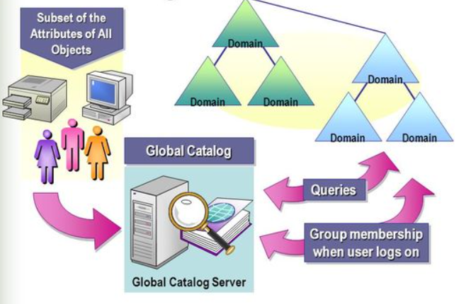

#### b) Operation Master

Domain Controller đóng vai trò là Operation Master để thực hiện tác vụ đảm bảo tính nhất quán, loại bỏ khả năng xung đột giữa các Entry trong cơ sở dữ liệu

Operation Master có 5 vai trò chính được Active Directory chỉ định đó là sơ đồ tổng thể, RID, tên miền Master, PDC và cơ sở hạ tầng.


**Như vậy**, Domain Controller đóng vai trò quan trọng và là một giải pháp hữu hiệu nhằm kiểm soát quyền truy cập vào các tài nguyên trong một Domain, thường được dành cho các IT Admin. Tại phòng máy chủ của các tổ chức, Domain Controller được tích hợp giống như các dịch vụ Active Directory.

## 2. Domain Control with Packet Filtering

### 2.1. Định nghĩa

Packet Filtering là một kỹ thuật tường lửa sử dụng để truy cập mạng kiểm soát bằng cách giám sát các gói tin đi và đến và cho phép họ vượt qua hoặc dừng lại dựa trên nguồn và đích Internet Protocol (IP) địa chỉ, giao thức và port.

Trong giao tiếp mạng, một nút truyền một gói tin đó được lọc và phù hợp với các quy tắc và chính sách được xác định trước. Khi xuất hiện, một gói hoặc là chấp nhận hoặc từ chối.

Packet Filtering Firewalls được chia thành hai loại:

- Stateless Firewalls kiểm tra các gói độc lập với nhau và thiếu ngữ cảnh
- Stateful Firewalls ghi nhớ thông tin về các gói đã truyền trước đó.

Lợi ích:

- Không sử dụng nhiều tài nguyên. Điều này có nghĩa là Firewall không có tác động lớn đến hiệu suất hệ thống và tương đối đơn giản.
- Ngoài ra còn nhanh chóng do packet filtering không kiểm tra nội dung bên trong của gói tin mà chỉ kiểm tra 1 số trường bên ngoài như source, destination, port, …

Hạn chế:

- Khả năng bảo vệ của Packet Filtering Firewall rất cơ bản và còn nhiều hạn chế.
- Dễ dàng bị vô hiệu trong trường hợp một yêu cầu độc hại được cho phép từ một địa chỉ nguồn đáng tin cậy.

### 2.2. Cơ chế

Khi có 1 gói tin đi đến, nó sẽ đi qua packet filter trước để kiểm tra. Ở đây nó sẽ check những thông tin như là source, destination, port để check xem có phù hợp hay không. Nếu kiểm tra phù hợp thì sẽ cho phép gói tin đi tiếp đến đích còn không thì sẽ loại gói tin khỏi đường truyền

- Ví dụ trường hợp thành công: Ở đây đã xác thực được điểm đến, cho phép gói tin đi tiếp đến đích.

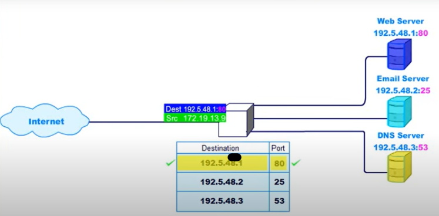

- Ví dụ trường hợp thất bại: Ở đây không xác thực được điểm đến, gói tin bị loại khỏi đường truyền.


### 2.3. Demo

**Lên ý tưởng**
Ý tưởng xây dựng dựa trên minh họa sau đây: [Demo Idea](https://www.youtube.com/watch?v=x0SyDYp0Brg)

Dựa trên ý tưởng này, mình xây dựng một chương trình python đơn giản để kiểm tra gói tin theo các firewall rules của Packet Filtering.

Input gồm 6 gói tin được gửi đến


Các rules thiết lập cho firewall như sau

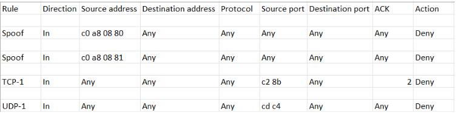

**Xây dựng chương trình minh họa**

Khởi tạo

```python
import csv
rulesFile = "firewall_rules.csv"  # firewall filtering rules
inputFile = "packet_input.txt"  # input contains packets
outputFile = "accept_packet_output.txt"  # output pass packets
```

Lọc ra các dữ liệu cần thiết để tiến hành lọc gói tin

```python
def writeToDictionary(packet):
    # write necessary details in ip datagram into data structure
    pktDetails = {}
    pktDetails["protocol"] = packet[69:71]  # TCP = 06  UDP = 11
    pktDetails["source address"] = packet[78:89]
    pktDetails["destination address"] = packet[90:101]
    pktDetails["source port"] = packet[102:107]
    pktDetails["destination port"] = packet[108:113]
    if pktDetails["protocol"] == "06":
        pktDetails["flag"] = packet[141:143]  # ACK set = 10 SYN = 02
    return pktDetails
```

Tiếp theo xây dựng các hàm tiện ích để thể hiện việc từ chối hay tiếp nhận gói tin

```python
def rejectPacket(index):
  print(f"Packet {index} rejected by the firewall")
def passPacket(file, datagram, index):
    with open(file, "a+") as output:
        output.seek(0)
        output.write(f"Package {index}: {datagram}")
    print(f"Packet {index} accepted by the firewall")
```

Viết điều kiện kiểm tra để lọc gói tin. Ở đây vì để cho đơn giản, mình sẽ lọc nếu protocol của gói tin gửi đến là **TCP** hoặc **UDP**. Các field chung cần kiểm tra là source address, destination address, source port, destination port. Khi đã match hết các field trên thì kiểm tra xem Action là **Deny** hay **Allow** để tiến hành loại bỏ hay chấp thuận gói tin đó. Ngoài ra, đối với TCP thì còn kiểm tra flag của gói tin để kiểm tra xem có phải là gói ACK hay không.

```python
def conditionFilter(datagram, rule):
    return (
        (
            datagram["source address"] == rule["Source address"]
            or rule["Source address"] == "Any"
        )
        and (
            datagram["destination address"] == rule["Destination address"]
            or rule["Destination address"] == "Any"
        )
        and (
            datagram["source port"] == rule["Source port"]
            or rule["Source port"] == "Any"
        )
        and (
            datagram["destination port"] == rule["Destination port"]
            or rule["Destination port"] == "Any"
        )
        and (
            datagram["protocol"] == "11"  # UDP
            or (
                datagram["protocol"] == "06"  # TCP need to check flag
                and (datagram["flag"] == rule["ACK"] or rule["ACK"] == "Any")
            )
        )
    )
```

Tiến hành lọc gói tin

```python
def firewall(packet, index):
    # get datagram from packet
    datagram = writeToDictionary(packet)
    with open(rulesFile, mode="r") as file:
        csvFile = csv.DictReader(file)  # read firewall filtering rules
        flag = False
        for row in csvFile:
            if flag == True:
                break
            if (
                datagram["protocol"] == "11" or datagram["protocol"] == "06"
            ):  # Filtering for UDP and TCP
                if conditionFilter(datagram, row):
                    flag = True
                    if row["Action"] == "Deny":
                        rejectPacket(index)
                        continue
                    elif row["Action"] == "Allow":
                        passPacket(outputFile, packet, index)
                        continue
        if flag == False:
            passPacket(outputFile, packet, index)
```

Chạy chương trình để kiểm tra kết quả

```python
index = 0
with open(inputFile) as inputFile:
    for datagram in inputFile:
        index += 1
        firewall(datagram, index)
```

**Kết quả đạt được**

Thông báo các gói tin được chấp thuận và bị từ chối. Ở đây gói tin 1,2,4,5 bị từ chối và chỉ có gói tin 3 và 6 được đi tiếp

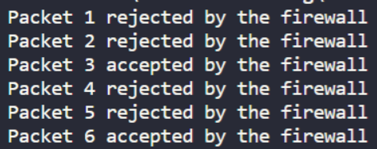

File output chứa các gói tin được chấp thuận đi tiếp

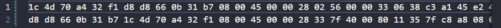

## 3. Domain Control with NAT

### 3.1. Khái niệm NAT

**Network Address Translation** (NAT) là kỹ thuật cho phép chuyển đổi từ một địa chỉ IP này thành một địa chỉ IP khác. Được dùng phổ biến trong mạng sử dụng địa chỉ cục bộ, cần truy cập đến mạng public (Internet). Vị trí thực hiện NAT là router biên kết nối giữa hai mạng

Có thể xem nó như một Router, chuyển tiếp các gói tin giữa những lớp mạng khác nhau trên một mạng lớn, còn có thể coi như một Firewall (tường lửa) cơ bản.

Trong giao tiếp mạng, một nút truyền một gói tin đó được lọc và phù hợp với các quy tắc và chính sách được xác định trước. Khi xuất hiện, một gói hoặc là chấp nhận hoặc từ chối.


NAT được chia thành ba loại chính:

- **Static Nat** chuyển đổi một địa chỉ IP này sang một địa chỉ khác một cách cố định, được cài đặt thủ công.
- **Dynamic NAT** ánh xạ một địa chỉ IP này sang một địa chỉ khác một cách tự động. Bất kỳ một địa chỉ IP nào nằm trong dải địa chỉ IP công cộng đã được định trước đều có thể được gán một thiết bị bên trong mạng.
- **NAT Overload** (còn gọi là Port Address Translation) là một dạng của Dynamic NAT, nó thực hiện ánh xạ nhiều địa chỉ IP thành một địa chỉ (many - to - one) và sử dụng các địa chỉ số cổng khác nhau để phân biệt cho từng chuyển đổi, phân biệt bởi port.


**Lợi ích**:

- Tiết kiệm địa chỉ IPv4 khi mà lượng người dùng truy cập internet ngày càng tăng cao, cứ tưởng tượng nếu mỗi người truy cập internet đều có riêng một địa chỉ IPv4 cố định thì con số địa chỉ IPv4 khổng lồ đến mức nào? Có còn đủ dùng hay không?
- Giúp che giấu IP bên trong mạng LAN.
- NAT giúp nhà quản trị mạng lọc được các gói tin đến và xét duyệt quyền truy cập của IP public đến 1 port bất kỳ.

**Hạn chế**:

- Khi dùng kỹ thuật NAT, CPU sẽ phải kiểm tra và tốn thời gian để thay đổi địa chỉ IP. Điều này làm tăng độ trễ trong quá trình switching, ảnh hưởng đến tốc độ mạng.
- Khó khăn khi cần kiểm tra nguồn gốc IP hoặc truy tìm dấu vết của gói tin.

### 3.2. Cơ chế NAT Firewall

Có thể mô tả ngắn gọn cơ chế của NAT như sau:

- Thiết bị gửi request đến Web server bằng cách gửi 1 packet chứa thông tin như IP người gửi và nhận, port number và thông tin được yêu cầu
- Traffic đi qua router có NAT firewall. NAT đổi private IP của packet thành public IP. Nó lưu lại sự thay đổi này và thêm vào forwarding table
- Packet đến được web server và lấy được thông tin cần thiết
- Thông tin nhận được quay về với router. NAT dùng forwarding table để xác định device nào là người gửi packet lúc đầu.
  NAT đổi public IP của packet thành private IP rồi trả về cho device

- NAT có dùng mask port number cho các host trong local network. Điều đó giúp tránh trường hợp 2 host trong cùng network (A và B) request đến cùng một server trên cùng một port; nếu NAT không mask port number cho 2 host A và B, response trả về từ server sẽ không biết thuộc về host nào.

### 3.3. Demo

Phần này sẽ bao gồm 2 ví dụ minh hoạ giúp hiểu rõ hơn về cơ chế của NAT như sau:

#### Ví dụ đầu tiên


- Ở ví dụ trên, host có IP 10.1.1.100 muốn gửi một request ra ngoài đến server có IP là 211.100.7.34/24, qua Router lưu lại một NAT Table chứa ánh xạ IP private - public, IP được đổi thành 162.105.178.65 và gửi request này đến server đích.
- Sau khi server 211.100.7.34/24 xử lý request và response được trả về cho Public IP 162.105.178.65, qua bộ lọc NAT Table tra cứu 162.105.178.65 tìm đến đúng host đã được ghi nhận lại với Private IP là 10.1.1.100.
- Một thông tin thêm là sau một khoảng thời gian đủ lâu mà cặp IP private-public không được sử dụng (ánh xạ), nó sẽ được giải phóng trong NAT Table để đỡ tốn bộ nhớ.

Dưới đây là 1 ví dụ khác mô phỏng động quá trình gửi request - nhận response có NAT như 1 firewall:


## 4. Domain Control with WAF

### 4.1. Định nghĩa

WAF là viết tắt của Web Application Firewall – tường lửa ứng dụng web. WAF được đặt giữa web client và server, đóng vai trò như là reverse proxy kiểm duyệt các giao thức HTTP trước khi chúng tiếp cận đến web server (phân tích lưu lượng HTTP, kiểm tra nội dung request và chặn bất kỳ thứ gì độc hại). Mục đích sử dụng WAF là nhằm bảo vệ các ứng dụng web và chống lại các cuộc tấn công website có chủ đích từ bên ngoài.

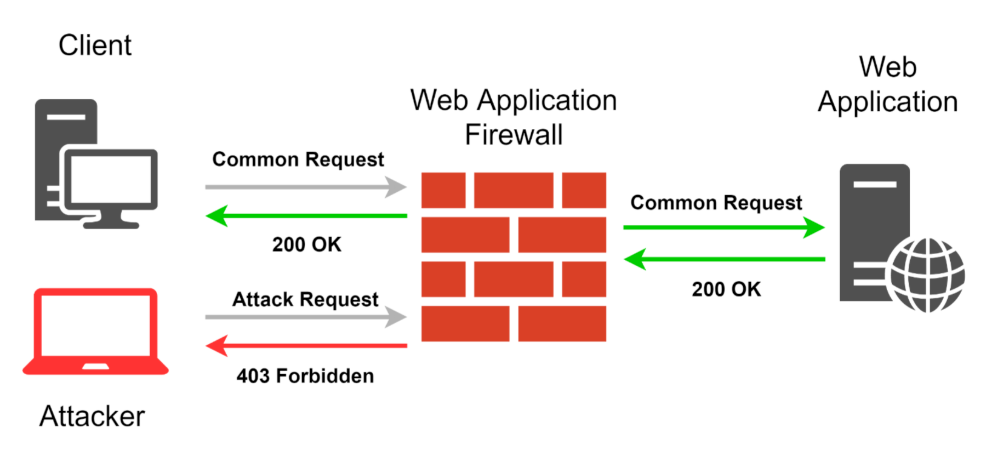

### 4.2. Mục đích sử dụng

Theo số liệu nghiên cứu từ trang [Penta Security](https://www.pentasecurity.com/), hơn 70% các cuộc tấn công được thực hiện thông qua web. Trong số đó, hơn 90% là nhắm vào các ứng dụng web, nghĩa là có hơn một nửa các cuộc tấn công mạng nhắm đến các ứng dụng web.

Bằng việc tích hợp WAF, ứng dụng web của bạn có thể tránh khỏi các truy cập độc hại:

- RCE (Remote Code Execution): loại tấn công cho phép người tấn công có thể thực thi các đoạn mã độc từ xa.
- XSS (Cross-site scripting): loại tấn công cho phép người tấn công dùng các ứng dụng web để gửi đi các mã độc đến các người dùng khác.
- DDoS (Distributed denial of service attack): phương pháp tấn công tạo nhiều lưu lượng truy cập ảo đến một service online, làm cho nó không thể sẵn sàng phục vụ những truy cập của user thật
- Botnet: là một tập các thiết bị được kết nối internet và được kiểm soát bởi một loại phần mềm độc hại. Dùng để spam, DDoS, tạo lưu lượng truy cập web và xem quảng cáo giả
- SQL Injection:
  - SQL Injection là một trong những kiểu hack web bằng cách inject các mã SQL query/command vào input trước khi chuyển cho ứng dụng web xử lí, từ đó người tấn công có thể login mà không cần username và password, remote execution (thực thi từ xa), dump data và lấy root của SQL server.
  - Nhờ vào khả năng kiểm tra được các request đến web server, WAF có thể giúp ta phòng chống được loại tấn công này. Tuy nhiên, do SQL Injection có rất nhiều biến thể khác nhau, ta cần phải viết các luật cho WAF sao cho bao quát được hết các trường hợp. Việc WAF không phát hiện được các cuộc tấn công loại này là hoàn toàn có thể xảy ra.

### 4.3. Cơ chế

Để WAF có thể bảo vệ ứng dụng web, ta cần phải định nghĩa ra các luật để nhận dạng các mẫu tấn công. Các luật đó thường được viết bằng Regex, thực hiện kiểm tra trên các thành phần của request (header, query string, param, body). WAF sẽ tuân theo những gì ta định nghĩa mà nhận dạng và ngăn chặn những request độc hại.

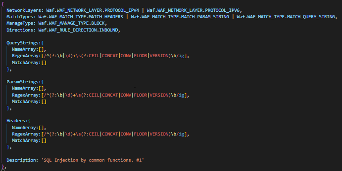

Một WAF sẽ sử dụng một trong ba mô hình sau để xử lý request sau khi đã kiểm duyệt:

- **Whitelist model**: Một whitelist chứa những chính sách, yếu tố để một request có thể thông qua. Một request sẽ bị chặn nếu nó chứa thành phần không nằm trong whitelist.
  - Lợi ích: Có thể chặn những cuộc tấn công mà developer không biết trước
  - Hạn chế: Sẽ có nhiều request hợp lệ nhưng không có các yếu tố trong whitelist cũng bị chặn
- **Blacklist model**: Một blacklist chứa những chính sách, yếu tố để chặn một request. Một request sẽ bị chặn nếu nó chứa bất cứ thành phần có trong blacklist.
  - Lợi ích: Dễ cài đặt
  - Hạn chế: Không đảm bảo giải quyết được tất cả các nguy cơ bị tấn công. Cần phải duy trì một danh sách lớn các dấu hiệu của một request xấu.
- **Hybrid model**: Kết hợp 2 mô hình trên

### 4.4. Các loại WAF

**Network-base WAFs (WAF dựa trên mạng)**

Network-based Web Application Firewalls (NWAF) là firewall được cài đặt bằng thiết bị phần cứng nằm cùng manjng cục bộ với web server. Nó có thể bảo vệ cả phần mạng cục bộ đó khỏi các cuộc tấn công bên ngoài.

Ưu điểm: Nhờ cài đặt cùng mạng cục bộ với server nên có latency thấp do request sẽ được điều hướng ngay lên server nếu WAF cho thông qua, ngoài ra còn có những ưu điểm nhờ vào việc nó được cài trên thiết bị phần cứng như băng thông lớn, xử lý được các kết nối song song.
Nhược điểm: Chi phí cao vì phải thuê người chuyên môn cài đặt và bảo trì thiết bị

**Host-based WAFs (WAF dựa trên máy chủ)**

Host-based Web Application Firewalls (HWAF) là firewall được cài đặt ngay trên host hoặc web server.

Ưu điểm: Dễ cài đặt tồn tại dưới dạng module của web server, đóng vai trò như là middleware xử lý các request đến web server. Đây là giải pháp rẻ hơn đáng kể so với WAF dựa trên phần cứng, dành cho các ứng dụng web nhỏ.
Nhược điểm: Server sẽ phải chịu tải vì các phép xử lý WAF chạy trên nó.

**Cloud – hosted WAFs (WAF được lưu trữ trên đám mây)**

Cloud-based Web Application Firewalls lá firewall được host trên cloud. Để cài đặt ta chỉ cần đăng ký dịch vụ này với cloud provider và đổi domain name của trang web trỏ tới địa chỉ IP của WAF mà họ cung cấp.

Ưu điểm: Dễ cài đặt, dễ mở rộng, chi phí thấp hơn so với network based. Ngoài ra còn có thể tích hợp AI để tự học cách phân loại các requests. Các giải pháp dựa trên cloud có ưu điểm là không bị giới hạn khả năng hoạt động hoặc tránh được việc phải bảo trì hệ thống thường xuyên.

### 4.5. Demo

Trong phần này, mình sẽ xây dựng Host-based WAFs ngay trên nodejs server dưới sự hỗ trợ của package [Mini-WAF](https://github.com/MurylloEx/Mini-WAF). Thông thường các thư viện sẽ có soạn sẵn các luật để chống những mối đe dọa phổ biến theo [OWASP rules "Top 10" attack techniques](https://www.cloudflare.com/learning/security/threats/owasp-top-10/).

Ta chỉ cần tạo WAF tương tự như một middleware cho ứng dụng web:

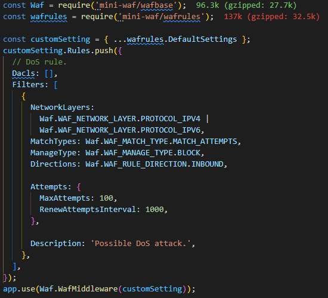

Kiểm tra độ chịu đựng của trang web trước các cuộc tấn công:

- DOS: Trong phần này mình sẽ tạo 100 hình ảnh có src là đường dẫn đến server, tương ứng nó sẽ tạo khoảng 100 requests đến server. Kết quả là WAF nhận ra đó có thể là DDOS nên chỉ cho thông qua một số request và chặn lại tất cả các request sau đó.
  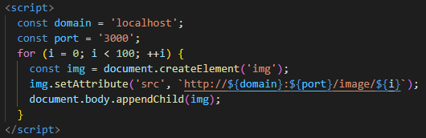
  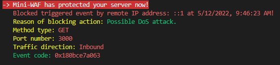
- SQL Injection: Tương tự, ta tạo 1 request có query param là 1 đoạn chứa câu lệnh SQL.
  
  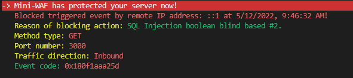
- XSS:
  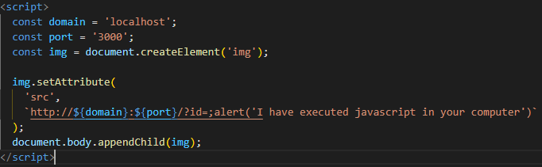
  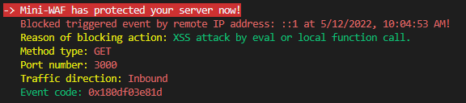

## 5. Domain Control with DMZ

### 5.1. Khái niệm DMZ (Demilitarized Zone)

DMZ là một vùng mạng **nằm giữa** mạng LAN và mạng Internet. Đây thường là nơi chứa các Public Servers cung cấp dịch vụ cho những host ở trong mạng LAN cũng như những host từ Internet. Các gói tin phải đến DMZ trước khi vào được mạng LAN.

Các dịch vụ thường được triển khai trong vùng DMZ là: Web Server, Mail Server, DNS Server, FTP Server…

### 5.2. Cơ chế

**Bài toán**: Hệ thống mạng LAN có thể bao gồm những Server cung cấp những dịch vụ cơ bản (Directory service, Database, DNS, DHCP, File/Print Sharing, Web, Mail, FTP...). Trong đó, những Server như Web, FTP, Mail, DNS... thường sẽ phục vụ cho cả user bên trong và bên ngoài mạng LAN. Nếu hacker từ mạng bên ngoài tấn công và chiếm quyền kiểm soát những Pulbic Servers này thì rất có thể chúng sẽ dựa vào đó để thâm nhập sâu hơn vào những máy trạm ở bên trong. Bài toán đặt ra là làm sao bảo mật hệ thống mạng LAN an toàn nhưng vẫn tiếp tục cung cấp dịch vụ của Web, FTP, Mail, DNS... cho Internet?

DMZ ra đời để giải quyết bài toán này theo cơ chế: DMZ sẽ thuộc những đường mạng hoặc subnet mạng khác với mạng LAN. Như vậy các host từ Internet sẽ không thể truy cập vào trong mạng LAN nhưng chúng vẫn có thể dùng những dịch vụ mà DMZ cung cấp.

Để tăng khả năng bảo mật hệ thống mạng LAN và giảm thiệt hại cho những host bên trong mạng LAN, giữa mạng LAN và DMZ ta có thể đặt một tường lửa để kiểm soát những lưu lượng từ DMZ vào mạng LAN, còn giữa DMZ với mạng ngoài ta có thể đặt thêm một tường lửa khác, nó sẽ kiểm soát những kết nối từ mạng ngoài đến DMZ.

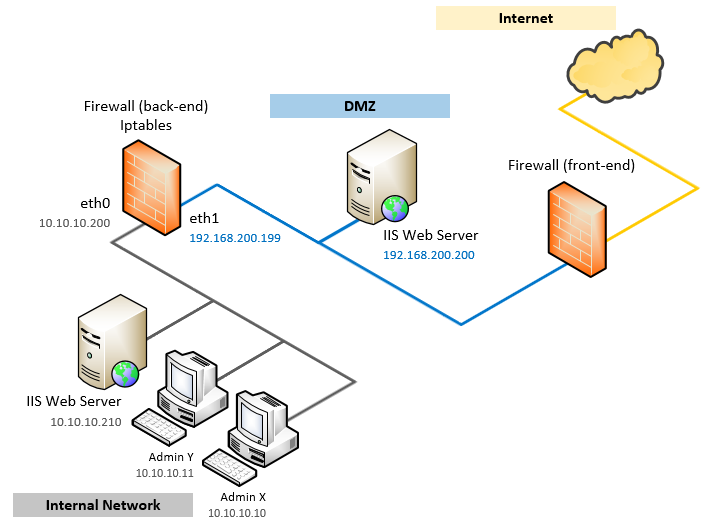

### 5.3. Demo

Ở đây ta có một hệ thống mạng LAN gồm các host, Database Server, Web Server và Email Server. Trong đó, Web Server và Email Server sẽ cung cấp dịch vụ cho Internet.

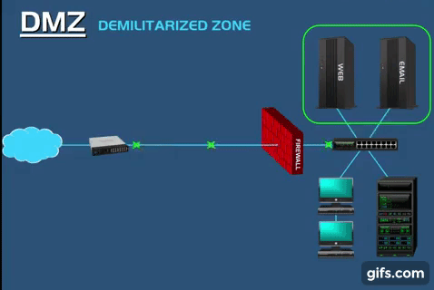

Dễ dàng thấy rằng hệ thống mạng LAN này thiếu tính bảo mật và rất dễ bị tấn công nếu hacker vượt qua được firewall. Khi hacker chiếm được quyền kiểm soát các Public Servers, chúng sẽ dễ dàng tấn công vào các sensitive server như là Database Server và tiến hành chỉnh sửa dữ liệu, đánh cắp thông tin hay cố tình chèn virus vào hệ thống. Điều này cực kỳ nguy hiểm và cần được ngăn chặn từ đầu.

 <!-- -->           |  <!-- -->
:-------------------------:|:-------------------------:
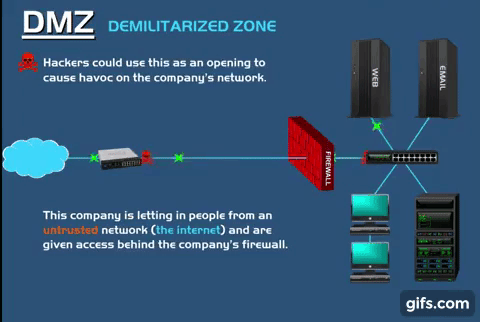  |  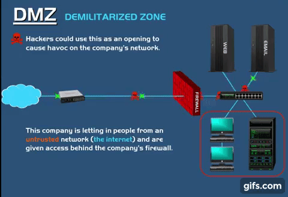

Để ngăn chặn cách tấn công này, ta tiến hành thiết kế hệ thống mạng LAN theo mô hình DMZ. Tách các Public Servers thành một vùng mạng / subnet mạng khác (gọi là vùng mạng DMZ), đồng thời đặt firewall giữa vùng mạng DMZ và mạng LAN để bảo vệ mạng LAN.

 <!-- -->           |  <!-- -->
:-------------------------:|:-------------------------:
  |  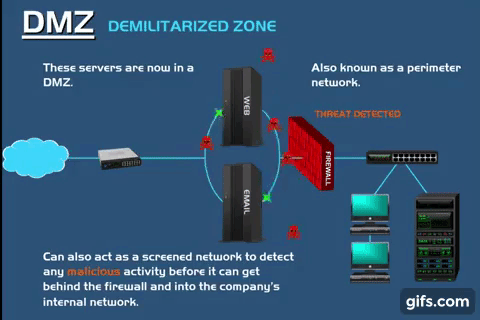

Để tăng cường tính bảo mật, bảo vệ cả các Server thuộc vùng mạng DMZ, ta có thể đặt thêm một firewall giữa DMZ và mạng ngoài để kiểm soát lưu lượng Internet vào DMZ.

 <!-- -->           |  <!-- -->
:-------------------------:|:-------------------------:
  |  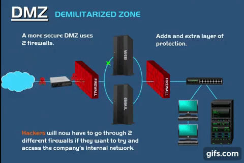

Lúc này, hệ thống đã thành công ngăn chặn được hacker với hai tường lửa và 2 đường mạng / subnet khác nhau.

## 6. Tổng kết

Sau đây là tóm lược lại thông tin của 4 dạng firewall liệt kê ở trên:

- Packet Filtering là một phương pháp để kiểm tra 1 gói tin bất kỳ đi qua firewall có hợp lệ hay không. Điều này được kiểm tra nhờ vào việc đọc một số thông tin trong phần header của gói tin đó, nếu hợp lệ thì cho phép gói tin đi tiếp, và ngược lại gói tin sẽ bị loại bỏ khỏi đường truyền.
  
- NAT là một domain controller với cơ chế ánh xạ một địa chỉ IP này thành một địa chỉ IP khác, còn được coi là tường lửa vì nó chỉ cho phép lưu lượng truy cập internet đi qua gateway khi được host trong network request. Mọi request hoặc packet không được yêu cầu (không được ghi nhận trong NAT Table) đều bị loại bỏ, ngăn chặn giao tiếp với các thiết bị nguy hiểm, đồng thời giúp tránh việc bị lộ thông tin.

- Web Application Firewall là phương pháp bảo vệ ứng dụng web bằng cách kiểm duyệt request có thể truy cập đến web server dựa trên những luật mà người dùng đặt ra. Việc định nghĩa các luật để quyết định một request là độc hại hay không có thể không bao quát hết được sự đa dạng của các phương pháp tấn công.

- DMZ là một vùng mạng chứa các Public Servers của hệ thống mạng LAN, được thiết kế nhằm mục đích tăng cường bảo mật, ngăn chặn các cuộc tấn công trực diện vào hệ thống mạng LAN trong trường hợp hacker kiểm soát được Public Server nào đó

## 7. References

- [1] [What is Domain Controller](https://www.techtarget.com/searchwindowsserver/definition/domain-controller/)
- [2] [Định nghĩa Domain Control](https://www.bkns.vn/domain-controller-la-gi.html/)
- [3] [Packet Filtering - Benefit and Type](https://www.indeed.com/career-advice/career-development/packet-filtering/)
- [4] [Firewall là gì](https://nhanhoa.com/tin-tuc/firewall-la-gi.html/)
- [5] [Packet Filter Demo](https://www.youtube.com/watch?v=ueGea2--ijc/)
- [6] [Simple Packet Filtering Firewall Design](https://github.com/GayanJayakody/Simple-packet-filtering-firewall-design/)
- [7] [Animation of Network Address Translation Concept](https://www.youtube.com/watch?v=ZBo_ZRRuN3U)
- [8] [CCNA 200-301: Network address translation](https://www.youtube.com/watch?v=eSmIov2DCvs)
- [9] [What Is NAT and What Are the Benefits of NAT Firewalls?](https://community.fs.com/blog/what-is-nat-and-what-are-the-benefits-of-nat-firewalls.html)
- [10] [What is a NAT Firewall? How Does It Work and Do You Need One?](https://www.addictivetips.com/vpn/nat-firewall/)
- [11] [What is a cloud firewall? What is FWaaS](https://www.cloudflare.com/learning/cloud/what-is-a-cloud-firewall/)
- [12] [Network Based Firewall vs Host Based Firewall - Discussion & Comparison](https://www.networkstraining.com/network-based-firewall-vs-host-based-firewall-discussion-and-comparison/)
- [13] [What is OWASP? What is the OWASP Top 10?](https://www.cloudflare.com/learning/security/threats/owasp-top-10/)
- [14] [Should exchange be in dmz?](https://moviecultists.com/should-exchange-be-in-dmz)
- [15] [Tăng cường bảo mật hệ thống mạng nội bộ với DMZ](https://securitybox.vn/1151/tang-cuong-bao-mat-he-thong-mang-noi-bo-voi-dmz/)
- [16] [Vùng DMZ là gì? Sự liên kết giữa DMZ và vùng khác trong bảo mật hệ thống mạng](https://25giay.vn/hoi-dap/vung-dmz-la-gi.html)
